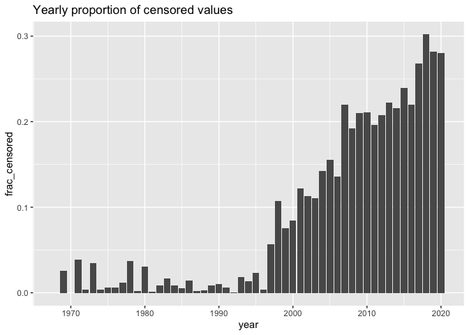

mixcens_paper
================
Martin Sköld
2022-12-20

This repository contains code and data used for figures and tables in
**Trend detection with non-detects in long-term monitoring, a mixed
model approach**. It uses the `mixcens` package available at
<https://github.com/mskoldSU/mixcens>.

## Data and Figure 1

A partial snapshot of the database is available as `data/full_data.csv`,
with measured concentrations (`value`) and censoring indicators (`cens`)
for a range of contaminants (`parameter`) and combinations of monitoring
year (`year`), stations (`location`) and matrices (`species`).

``` r
library(tidyverse)
full_data <- read_csv("https://owncloud.nrm.se/index.php/s/FRAEvbSPRUWIGJi/download")
full_data |> group_by(year) |> 
  summarise(frac_censored = mean(cens)) |> 
  ggplot(aes(x = year, y = frac_censored)) + geom_col() + labs(title = "Yearly proportion of censored values")
```

<!-- -->

## Figure 2

Figure 2 contains density estimates (`ggplot::geom_density` with default
settings) of estimated standard deviations from the monitoring
programme. Standard deviations were computed for all combinations of
year/species/location/contaminant with at least four distinct uncensored
values using helper function `sd_cens` calling `EnvStats::enormCensored`

``` r
sd_cens <- function(x, cens){
  # Estimate standard deviation of x with left-censoring indicators cens
  if (all(!cens)){
    sd(x)
  } else {
    fit <- EnvStats::enormCensored(x, cens)
    fit$parameters[2]
  }
}

full_data |> 
  nest_by(species, loc, year, parameter) |> 
  filter(n_distinct(data$value[data$cens == FALSE]) > 3) |> 
  mutate(sigma = sd_cens(log(data$value), data$cens)) |> 
  ggplot(aes(x = sigma)) + geom_density(fill = "grey")
```

<!-- -->

## Method comparisons

The function `tidy_fit` is the main workhorse for computing summary
tables for the methods compared.

``` r
tidy_fit <- function(method, data, trend.only = TRUE){
  if (method == "MM"){
    fit <- mixcens::mixcens(data$year, data$value, data$cens)
    result <- tibble(term = c("(Intercept)", "year", "s", "sigma"),
                     estimate = c(fit$beta[1:2], sqrt(exp(fit$beta[3:4]))),
                     std.error = sqrt(c(fit$varFix[1, 1], fit$varFix[2, 2], NA, NA)),
                     statistic = estimate / std.error,
                     p.value = pnorm(-abs(statistic)) + (1 - pnorm(abs(statistic))),
                     p.value.lr = (1- pchisq(fit$loglik, 1)))
  }
  if (method == "TM"){
    fit <- NADA::cenreg(Cen(data$value, data$cens) ~ data$year) |> summary()
    result <- tibble(term = c("(Intercept)", "year"),
                     estimate = fit$table[1:2, 1],
                     std.error = fit$table[1:2, 2],
                     statistic = fit$table[1:2, 3],
                     p.value = fit$table[1:2, 4])
  }
  if (method == "RC"){
    data <- filter(data, !cens) |> 
      group_by(year) |> 
      summarise(value = exp(mean(log(value))), .groups = "drop")
    fit <- lm(log(value) ~ year, data)
    result <- broom::tidy(fit)
  }
  if (method == "S1"){
    data <- mutate(data, value = ifelse(cens, value / 2, value)) |> 
      group_by(year) |> 
      summarise(value = exp(mean(log(value))), .groups = "drop")
    fit <- lm(log(value) ~ year, data)
    result <- broom::tidy(fit)
  }
  if (method == "S2"){
    data <- mutate(data, value = ifelse(cens, value / sqrt(2), value)) |> 
      group_by(year) |> 
      summarise(value = exp(mean(log(value))), .groups = "drop")
    fit <- lm(log(value) ~ year, data)
    result <- broom::tidy(fit)
  }
  if (trend.only) {
    filter(result, term == "year")
  } else {
    result
  }
}
```

we extract lindane data by

``` r
lindane_data <- full_data |> 
  filter(loc %in% c("ANGK", "ANGV", "FLAD", "LAND", "UTLA", "UTLV", "HAFJ"), 
         parameter == "LINDA",
         species == "CLUP",
         year < 2020) # 2020 measurements were made by a different lab and removed
```

and compute tables by e.g.

``` r
lindane_data |> 
  nest_by(loc) |> 
  summarise(tidy_fit("MM", data), .groups = "drop")
```

    ## # A tibble: 7 × 7
    ##   loc   term  estimate std.error statistic   p.value p.value.lr
    ##   <chr> <chr>    <dbl>     <dbl>     <dbl>     <dbl>      <dbl>
    ## 1 ANGK  year    -0.172   0.0135      -12.7 2.97e- 37   1.11e-16
    ## 2 ANGV  year    -0.146   0.00665     -22.0 9.87e-108   0       
    ## 3 FLAD  year    -0.181   0.0130      -13.9 5.03e- 44   0       
    ## 4 HAFJ  year    -0.144   0.00941     -15.3 4.79e- 53   0       
    ## 5 LAND  year    -0.140   0.00560     -25.0 5.90e-138   0       
    ## 6 UTLA  year    -0.143   0.00485     -29.5 3.90e-192   0       
    ## 7 UTLV  year    -0.161   0.00690     -23.4 2.97e-121   0

Confidence intervals in Figure 4 are simple Normal Wald-intervals based
on `std.error`in the tables. Table 1 of variance components is derived
from

``` r
lindane_data |> 
  nest_by(loc) |> 
  summarise(tidy_fit("MM", data, trend.only = FALSE), .groups = "drop") |> 
  filter(term %in% c("s", "sigma")) |> 
  select(loc, term, estimate)
```

    ## # A tibble: 14 × 3
    ##    loc   term  estimate
    ##    <chr> <chr>    <dbl>
    ##  1 ANGK  s       0.260 
    ##  2 ANGK  sigma   0.160 
    ##  3 ANGV  s       0.140 
    ##  4 ANGV  sigma   0.141 
    ##  5 FLAD  s       0.418 
    ##  6 FLAD  sigma   0.106 
    ##  7 HAFJ  s       0.165 
    ##  8 HAFJ  sigma   0.155 
    ##  9 LAND  s       0.180 
    ## 10 LAND  sigma   0.108 
    ## 11 UTLA  s       0.168 
    ## 12 UTLA  sigma   0.0885
    ## 13 UTLV  s       0.167 
    ## 14 UTLV  sigma   0.102

## Nickel data

Nickel data in Figure 6 is extracted as

``` r
nickel_data <- full_data |> 
  filter(parameter %in% c("NITS", "NITSI"),
         species == "CLUP",
         loc == "FLAD")
```

## Simulation study

Finally we present the code for the power simulation study.

``` r
library(NADA) # Required for TM method

sigma <- seq(0.1, 0.7, length.out = 5) # 5 x 3 x 3 simulated combinations (2000 x 3 x 3 was used in paper)
s <- c(0, .1, .3) # Values of s
cens <- c(.25, .5, .75) # Censoring proportions

sim_pars <- expand_grid(sd = sigma, sd_b = s, p_cens = cens) |> 
  mutate(sd_tot = sqrt(sd_b^2 + sd^2),
         loq = exp(qnorm(p_cens, mean = 0, sd = sd_tot)))

sim_ni <- function(sd_b, sd, loq, n = 20, ...){
  tibble(year = rep(1:n, each = 10), 
         b = rep(rnorm(n, mean = 0, sd = sd_b), each = 10),
         value = exp(b + rnorm(10 * n, mean = 0, sd = sd)),
         cens = (value < loq) & (year > n / 2)
  ) |> 
    mutate(value = ifelse(cens, loq, value))
}

set.seed(1)
sim_data <- sim_pars |> 
  mutate(data = pmap(sim_pars, sim_ni))  |>  
  group_by(p_cens, sd_b, sd) |> 
  rowwise()


sim_study_ni <- bind_rows(summarise(sim_data, tidy_fit("MM", data), .groups = "drop") |> 
                            mutate(method = "MM"),
                          summarise(sim_data, tidy_fit("TM", data), .groups = "drop") |> 
                            mutate(method = "TM"),
                          summarise(sim_data, tidy_fit("RC", data), .groups = "drop") |> 
                            mutate(method = "RC"),
                          summarise(sim_data, tidy_fit("S1", data), .groups = "drop") |> 
                            mutate(method = "S1"),
                          summarise(sim_data, tidy_fit("S2", data), .groups = "drop") |> 
                            mutate(method = "S2")
)
sim_study_ni |> 
  mutate(y = as.numeric(p.value < .05)) |> # Response for logistic regresison
  ggplot(aes(x = sd, y = y, color = method)) + 
  geom_smooth(method = "gam", method.args = list(family = "binomial"), formula = y ~s(x, fx = TRUE, k = 5), se = FALSE) +
  facet_grid(method ~ sd_b)
```

<!-- -->

Of course, more samples are needed here.
